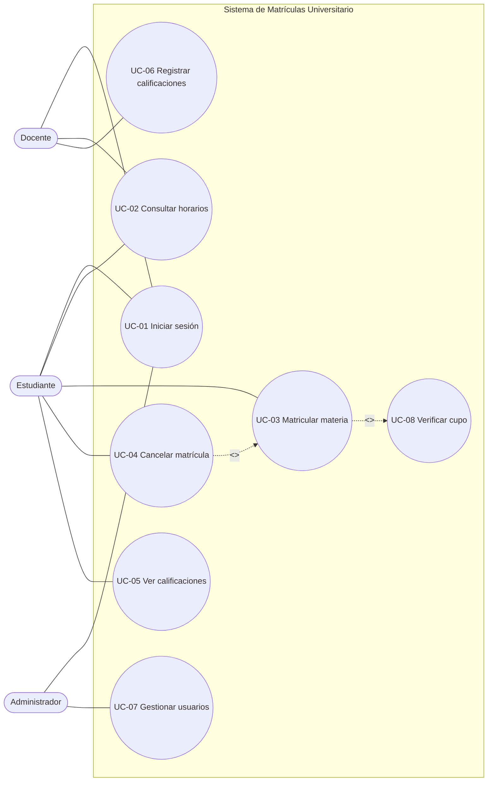

# 2. Modelo de Casos de Uso del Sistema

Esta sección define el modelo funcional del sistema y constituye la base del backlog del proyecto.

Las funcionalidades generales identificadas en el lanzamiento se refinan aquí en casos de uso estructurados, los cuales representan objetivos completos de los actores sobre el sistema.

---

## 2.1 Diagrama de Casos de Uso del Sistema

---

## 2.2 Identificación de actores

Un actor representa un rol externo al sistema.

### Actor A-01 – Estudiante

* Tipo: Primario
* Descripción: Usuario que gestiona su proceso de matrícula
* Objetivo: Registrar, consultar y administrar sus materias

---

### Actor A-02 – Docente

* Tipo: Secundario
* Descripción: Responsable de la gestión académica
* Objetivo: Registrar y consultar calificaciones

---

### Actor A-03 – Administrador

* Tipo: Primario
* Descripción: Responsable de la administración del sistema
* Objetivo: Gestionar usuarios y configuración

---

## 2.3 Inventario de Casos de Uso

### UC-01 – Iniciar sesión

* Actor: Estudiante / Docente / Administrador
* Descripción: Permite autenticarse en el sistema
* Prioridad: Must
* Sprint: 1

---

### UC-02 – Consultar horarios

* Actor: Estudiante / Docente
* Descripción: Permite visualizar horarios disponibles
* Prioridad: Must
* Sprint: 1

---

### UC-03 – Matricular materia

* Actor: Estudiante
* Descripción: Permite registrar una materia
* Prioridad: Must
* Sprint: 1
* Relación: <<include>> UC-08

---

### UC-04 – Cancelar matrícula

* Actor: Estudiante
* Descripción: Permite cancelar una materia
* Prioridad: Should
* Sprint: 2
* Relación: <<extend>> UC-03

---

### UC-05 – Ver calificaciones

* Actor: Estudiante
* Descripción: Permite consultar notas
* Prioridad: Must
* Sprint: 1

---

### UC-06 – Registrar calificaciones

* Actor: Docente
* Descripción: Permite registrar notas
* Prioridad: Must
* Sprint: 2

---

### UC-07 – Gestionar usuarios

* Actor: Administrador
* Descripción: Permite administrar usuarios
* Prioridad: Should
* Sprint: 2

---

### UC-08 – Verificar cupo

* Actor: Sistema
* Descripción: Verifica disponibilidad antes de matrícula
* Prioridad: Must
* Sprint: 1

---

## 2.4 Priorización

### Sprint 1 (Must)

* UC-01
* UC-02
* UC-03
* UC-05
* UC-08

---

### Sprint 2 (Should)

* UC-04
* UC-06
* UC-07

---

## 2.5 Validación

* Todos los actores tienen al menos un caso de uso
* Todos los casos de uso tienen un actor
* El modelo cubre el problema del negocio
* Existe coherencia entre actores, casos de uso y backlog

---

## 2.6 Trazabilidad

Cada caso de uso debe relacionarse con:

* especificación detallada
* modelo de análisis
* diseño
* código
* pruebas

Si no es trazable, no está correctamente definido.
